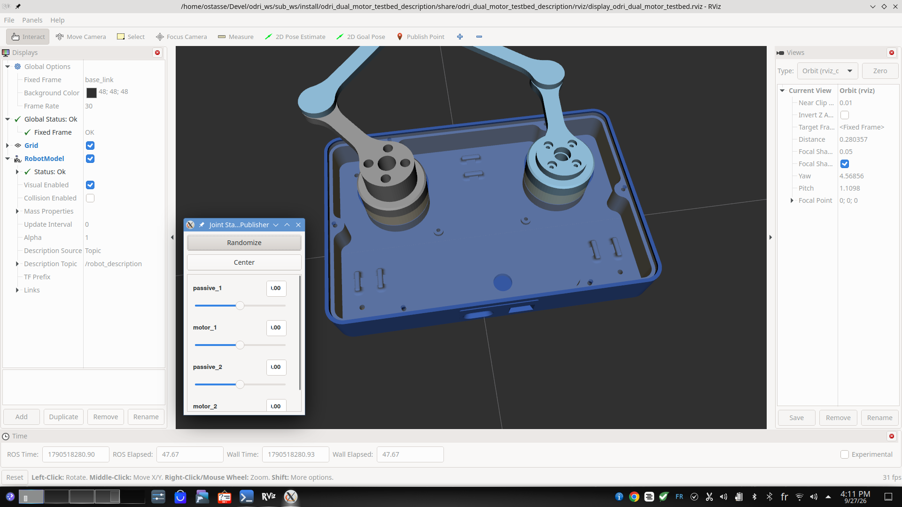
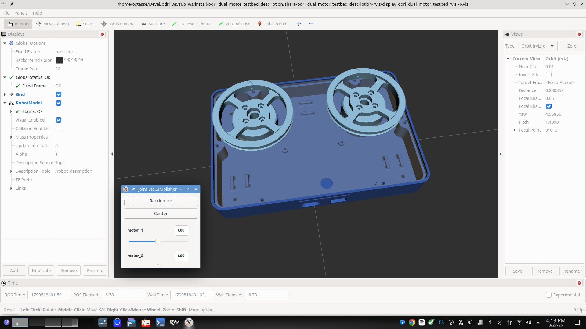

Robot models
============

The package describes two variants of the MOTKIN dual motor testbed. Both share
the same base (``base_link`` / ``case`` / ``top_cover``) and the same two
actuated joints, ``motor_1`` and ``motor_2``, so that the same hardware
interface and controllers can drive either of them. Both were exported from
Onshape with `onshape-to-robot <https://github.com/Rhoban/onshape-to-robot>`_
and then adapted for ROS 2.

The model is selected with the ``robot_model`` launch argument (see
:doc:`launch_files`).

Five-bar linkage (``fivebar_2dof``)
-----------------------------------

   ``ros2 launch motkin_dual_motor_testbed_description show.launch.py robot_model:=fivebar_2dof``

A planar closed-chain mechanism with two degrees of freedom. Each motor drives
a crank (``rotor`` and ``rotor_2``), and a passive arm is attached at the end
of each crank. The two arm tips meet at the end effector, which closes the
kinematic loop.

* Top-level file: ``robots/fivebar_2dof_robot.urdf.xacro``
* Kinematic tree: ``urdf/fivebar_2dof.urdf.xacro``
* Meshes: ``meshes/assets/five_bar/``

.. list-table:: Joints
   :header-rows: 1
   :widths: 20 15 20 45

   * - Joint
     - Type
     - Parent → child
     - Role
   * - ``motor_1``
     - continuous
     - ``case`` → ``rotor``
     - Actuated, left crank angle θ\ :sub:`1`
   * - ``motor_2``
     - continuous
     - ``case`` → ``rotor_2``
     - Actuated, right crank angle θ\ :sub:`2`
   * - ``passive_1``
     - continuous
     - ``rotor`` → ``arm_l2``
     - Passive, left elbow β\ :sub:`1`
   * - ``passive_2``
     - continuous
     - ``rotor_2`` → ``arm_r2``
     - Passive, right elbow β\ :sub:`2`

URDF cannot express closed chains, so the model is exported as an open tree.
The fixed frames ``closing_tip_1`` (on ``arm_r2``) and ``closing_tip_2`` (on
``arm_l2``) mark the two arm tips that must coincide when the loop is closed.

* **In RViz**, ``joint_state_publisher_gui`` shows a slider for each of the four
  joints, so the loop only closes when the passive sliders are set to match the
  motor sliders.
* **In Gazebo**, the ``FiveBarClosurePlugin`` (from
  ``motkin_dual_motor_testbed_gazebo``) joins ``arm_l2`` and ``arm_r2`` at the
  closure point P with a planar pin constraint. At every step it computes the
  force transmitted at P (the Lagrange multiplier of the constraint) and
  applies it to both arms, so ``passive_1`` and ``passive_2`` follow from the
  simulated dynamics. The exact direct geometric model is only used to
  assemble the loop at start-up. The parameters are in
  ``gazebo/gazebo_fivebar_2dof.urdf.xacro``; the derivation is in
  `five_bar_mgd_spec.md <https://github.com/Gepetto/motkin-dual-motor-testbed-robot/blob/main/motkin_dual_motor_testbed_robot/doc/five_bar_mgd_spec.md>`__.

.. note::

   The mechanism moves in the (x, y) plane of ``case``, and both motor axes
   point along its −z axis. With the base flat on the table the five-bar is
   therefore **horizontal**, and gravity produces no torque on the motors.

.. note::

   ``passive_1`` and ``passive_2`` use the axis ``0 0 -1`` instead of the
   ``0 0 1`` produced by the CAD export. This matches the sign convention of
   the closure model. The header of ``urdf/fivebar_2dof.urdf.xacro`` lists
   every change made to the raw export; apply them again whenever the model
   is regenerated.

Dual flywheel (``dual_flywheel``)
---------------------------------

   ``ros2 launch motkin_dual_motor_testbed_description show.launch.py robot_model:=dual_flywheel``

The same base with a flywheel mounted on each motor instead of the five-bar
arms. Each motor is independent, which makes this setup convenient for
identifying the motors and tuning low-level control.

* Top-level file: ``robots/dual_flywheel_robot.urdf.xacro``
* Kinematic tree: ``urdf/dual_flywheel.urdf.xacro``
* Meshes: ``meshes/assets/dual_flywheel/``

.. list-table:: Joints
   :header-rows: 1
   :widths: 20 15 20 45

   * - Joint
     - Type
     - Parent → child
     - Role
   * - ``motor_1``
     - continuous
     - ``case`` → ``rotor``
     - Actuated, left flywheel
   * - ``motor_2``
     - continuous
     - ``case`` → ``rotor_2``
     - Actuated, right flywheel

Common structure
----------------

In both models the top-level file declares a ``world`` link and fixes
``base_link`` to it 1 mm above the origin (joint ``base_link_in_world``).
``base_link`` is an empty root link added by the export; the base mass is
carried by ``case``, which is rigidly attached to it together with
``top_cover``.

.. code-block:: text

   world
   └── base_link                (fixed: base_link_in_world)
       ├── case                 (fixed: base_link_to_case)
       │   ├── rotor            (motor_1)
       │   │   └── arm_l2       (passive_1, five-bar only)
       │   │       ├── closing_tip_2
       │   │       └── closing_tip_2_z
       │   └── rotor_2          (motor_2)
       │       └── arm_r2       (passive_2, five-bar only)
       │           ├── closing_tip_1
       │           └── closing_tip_1_z
       └── top_cover            (fixed: base_link_to_top_cover)

Xacro arguments
---------------

Both top-level files accept the following arguments:

.. list-table::
   :header-rows: 1
   :widths: 25 15 60

   * - Argument
     - Default
     - Description
   * - ``gz_sim``
     - ``false``
     - ``true`` includes ``gazebo/gazebo_<robot_model>.urdf.xacro`` (Gazebo
       ros2_control system and plugins). ``false`` includes the real hardware interface
       (see :doc:`hardware_interfaces`).
   * - ``robot_namespace``
     - ``""``
     - ROS namespace given to the Gazebo ros2_control plugin, so that several
       robots can be spawned in the same world (used by
       ``motkin_dual_motor_testbed_haptic_pair``).
   * - ``controller_params_file``
     - (none)
     - Controller manager parameters loaded by the Gazebo plugin. Needed only
       when ``gz_sim:=true``.

For example, to generate the URDF of the five-bar for Gazebo:

.. code-block:: bash

   xacro $(ros2 pkg prefix --share motkin_dual_motor_testbed_description)/robots/fivebar_2dof_robot.urdf.xacro \
     gz_sim:=true \
     controller_params_file:=$(ros2 pkg prefix --share motkin_dual_motor_testbed_gazebo)/config/forward_command_controller.yaml
