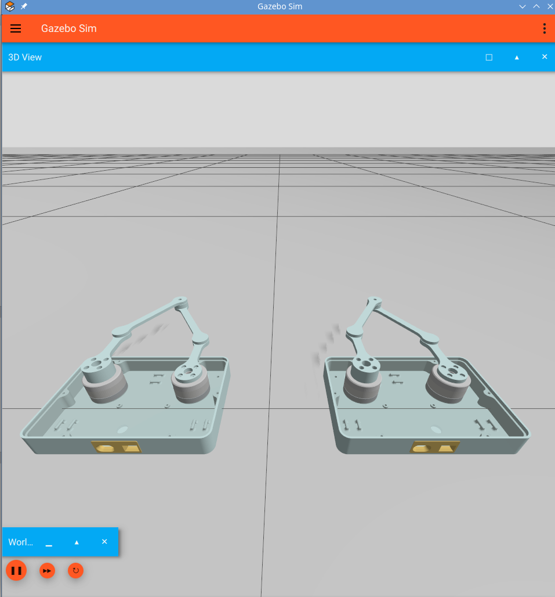

odri_dual_motor_testbed_haptic_pair
===================================

Simulates two ``odri_dual_motor_testbed`` five-bar robots as a haptic pair in
one Gazebo world: a **leader** that receives an external contact force (its
haptic-sensor input) and a **follower** that reproduces it.

   The leader (left) and the follower (right) in Gazebo Harmonic.

Quick start:

.. code-block:: bash

   ros2 launch odri_dual_motor_testbed_haptic_pair haptic_pair.launch.py

.. toctree::
   :maxdepth: 2
   :caption: Contents

   package_structure
   architecture
   launch_files
   implementation_notes
